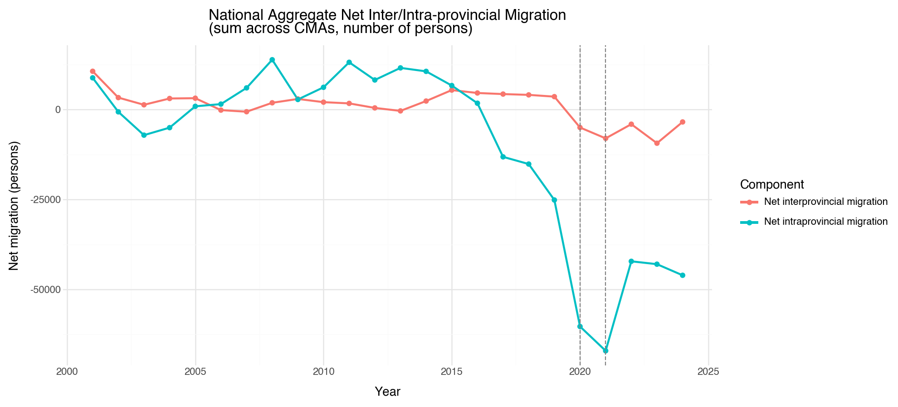
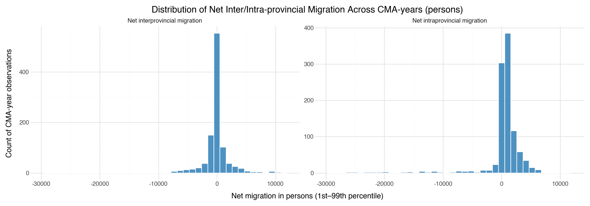
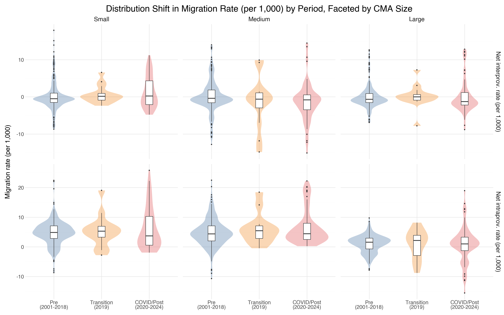
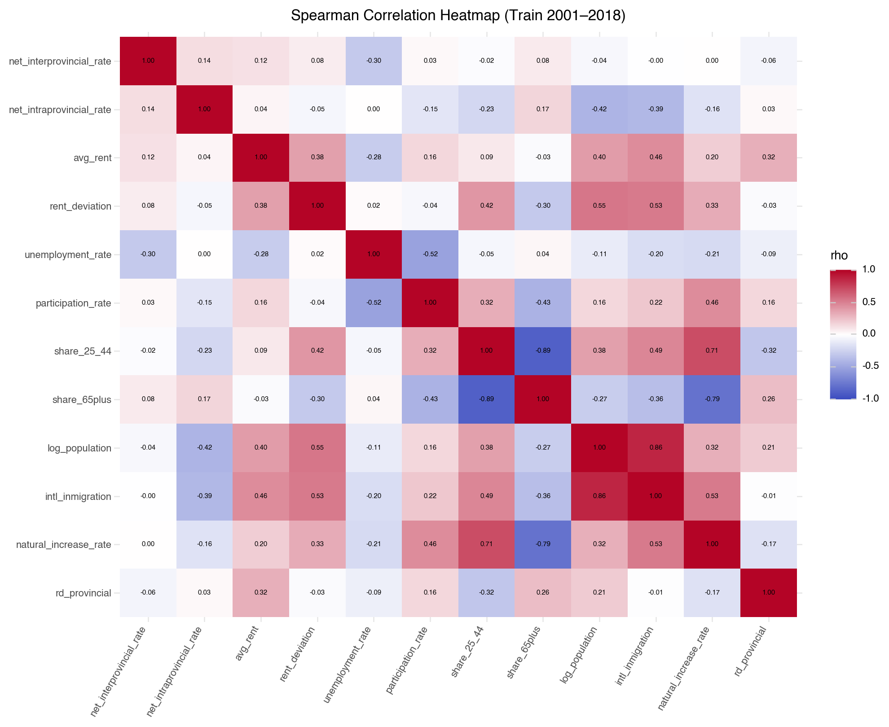
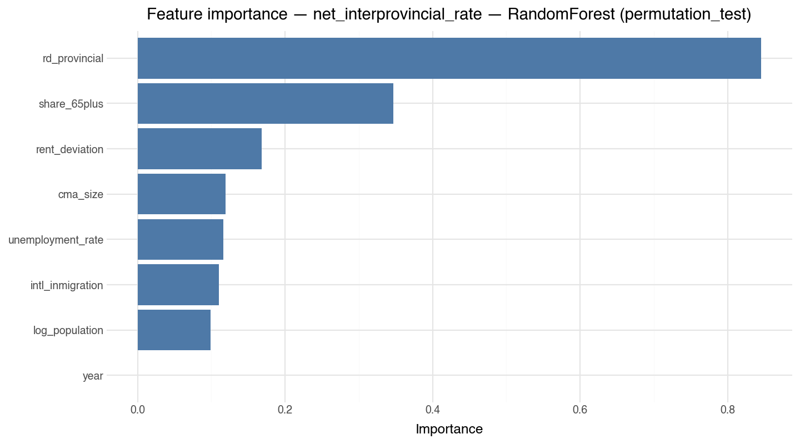
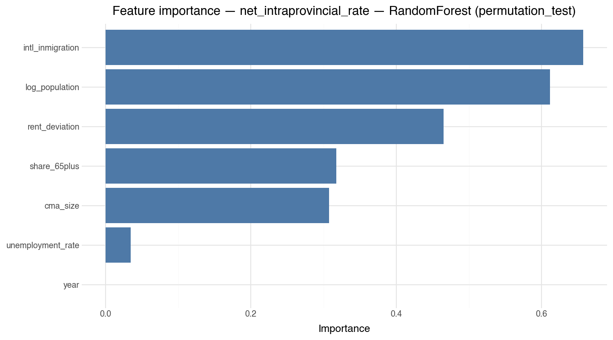
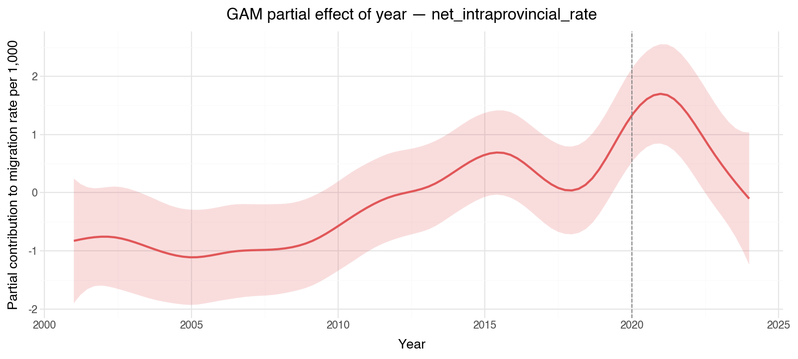

<!-- Link to GitHub repository: <https://github.com/jennifer1046/JSC370/tree/main/JSC370_2026/project/canada_migration>

Raw StatCan bulk CSV files are gitignored due to size; the processed Census Metropolitan Area (CMA) panel and the train/test splits are under `data/processed/`, and every figure and table in this report is stored in `outputs/figures/` and `outputs/tables/`. -->

## Introduction

### Background

Regulations and stories about immigration have pervaded Canadian news in recent years. Much less attention is being paid to internal migration. Yet the study of internal migration can inform planning for infrastructure and public services, as well as helping researchers understand the change in the population composition of different regions. From the early 1970s to the late 2010s, Canada’s aggregated number of interprovincial migrants is relatively stable (Chastko, 2021). However, the net interprovincial migration rate differs substantially across provinces. Another source of instability lies in the destinations of internal migration. While the Canadian population is still concentrated in a few areas such as Toronto, Vancouver and Montreal, these Census Metropolitan Areas (CMAs) have seen an exodus in recent years owing to high housing cost and general cost of living (McQuillan, 2024).

The article by Song et al. (2026) explains the motivation for the movement within and across provinces, citing housing conditions and employment opportunities as the top reasons. These results are based on the Canadian Housing Survey conducted in 2022. 

A push factor is a local condition that encourages residents to leave, e.g., high rent, elevated unemployment, or an aging population. A pull factor is a condition that attracts residents, like employment opportunity and affordability.

### Project Goals

**Primary (prediction):**

- RQ1: How much variance in net internal (interprovincial and intraprovincial) migration rates in Canada can be predicted by demographic and socioeconomic push and pull factors? 

- RQ2: Extending RQ1, does lagging the key push/pull factor by one to two years improve out-of-time prediction of net migration rates above the contemporaneous baseline? For instance, increased rental pressure prompts people to move, but this effect is likely not immediate. 

**Secondary (inference):** 

- RQ3: Is the 2020–2024 Covid period associated with a structural shift in migration, and does that shift differ by CMA size? 

### Hypotheses
- H1. The push and pull factors of the two types of migration are likely different. 
- H2. The models with lagged variables are hypothesized to perform slightly better than the baseline. 
- H3. Large CMAs show systematic out-migration during the 2020-2024 period, while mid-sized CMAs are the primary destinations.

### Datasets

All five tables are retrieved from Statistics Canada, using its API. Tables are cached locally for reusability and efficiency:

- **17-10-0149-01** — Components of population change by CMA, 2021 boundaries (outcome, `intl\_inmigration`)
- **17-10-0148-01** — Population estimates July 1 by CMA, 2021 boundaries (`population`, `share_25_44`, `share_65plus`)
- **34-10-0133-01** — Canada Mortgage and Housing Corporation, average rents for areas with a population of 10,000 and over (`avg_rent`, derived `rent_deviation`)
- **14-10-0020-01** — Provincial unemployment and participation rate
- **27-10-0273-02** — Provincial R&D expenditures by performing sector

After cleaning, the merged panel contains **40 CMAs × 24 years = 960 CMA-year observations**.

## Methods

### Data acquisition

The Statistics Canada API is used to pull tabular data over the year range 2001 to 2024 or the latest year for which data is available. The helper `pull_statcan(table_id)` downloads the bulk CSV ZIP, extracts the data, and returns a pandas DataFrame. Each call is cached under local directory to avoid unnecessary API calls. 

To ensure datasets can be merged harmoniously, all tables have annually collected data. The geographic granularity for most tables is Census Metropolitan Area (CMA) and Census Agglomeration (CA). **The unit of analysis for this project is CMAs.** Thus, tables are filtered to rows that correspond to CMAs only, except for R&D table and unemployment rates table.

### Cleaning, merging, and missingness
Geographic labels follow two incompatible conventions across tables (`"Toronto (CMA), Ontario"` vs. `"Toronto, Ontario"`); a `normalise_geo` function strips the type suffix, removes whitespace and lowercases, producing a consistent `geo_key` used in every join.

Null values can occur for 3 reasons: 

  1. Statistical suppression, where Statistics Canada withholds values for small geographic areas.

  2. Geographic mismatch, where the CMA key in a table does not match any key in the main table. 

  3. Isolated year gaps, where a CMA existed in a source table but was missing for a small number of years.

To make the treatment of missingness reproducible, first, if a CMA could not be matched consistently to the harmonized geography key after normalization, it was dropped. This occurred for the rent series of Belleville–Quinte West and Ottawa–Gatineau (Ontario part). Second, if a CMA had a single missing year within an otherwise complete time series, imputation was used. Specifically, Chilliwack was missing rent data for 2006, so that value was imputed as the mean of the adjacent observed years 2005 and 2007. Any broader missingness that could not be justified by a clear harmonization rule was handled by exclusion.

```{python}
#| label: out-nan-diagnosis
#| output: asis
from pathlib import Path
from html import escape
import os
import pandas as pd

PROJECT_ROOT = Path.cwd()
TABLES_DIR = PROJECT_ROOT / "outputs" / "tables"
FIG_DIR = PROJECT_ROOT / "outputs" / "figures"

IS_PDF = os.environ.get('QUARTO_OUTPUT_FORMAT', 'html').lower() == 'pdf'

def md_table(df: pd.DataFrame, formats: dict | None = None) -> str:
    formats = formats or {}
    def fmt_val(col, val):
        if pd.isna(val): return ""
        f = formats.get(col)
        return f.format(val) if isinstance(f, str) else str(val)
    cols = df.columns.tolist()
    header = "| " + " | ".join(str(c) for c in cols) + " |"
    sep    = "| " + " | ".join(["---"] * len(cols)) + " |"
    body   = "\n".join("| " + " | ".join(fmt_val(c, row[c]) for c in cols) + " |" for _, row in df.iterrows())
    return "\n".join([header, sep, body])

def latex_table(df: pd.DataFrame, formats: dict | None = None) -> str:
    formats = formats or {}
    def _esc(s): return s.replace('_', r'\_').replace('%', r'\%').replace('&', r'\&')
    def fmt_val(col, val):
        if pd.isna(val): return ""
        f = formats.get(col)
        s = f.format(val) if isinstance(f, str) else str(val)
        return _esc(s) if df[col].dtype == object else s
    cols = df.columns.tolist()
    col_spec = "l" + "r" * (len(cols) - 1)
    header = " & ".join(f"\\textbf{{{str(c).replace('_', ' ')}}}" for c in cols) + r" \\"
    rows = " \\\\\n".join(" & ".join(fmt_val(c, row[c]) for c in cols) for _, row in df.iterrows())
    return f"\\begin{{tabular}}{{{col_spec}}}\n\\hline\n{header}\n\\hline\n{rows} \\\\\n\\hline\n\\end{{tabular}}"

def html_table(df: pd.DataFrame, formats: dict[str, object] | None = None, group_col: str | None = None) -> str:
    formats = formats or {}

    def fmt_value(col, val):
        if pd.isna(val):
            return ""
        formatter = formats.get(col)
        if callable(formatter):
            return formatter(val)
        if isinstance(formatter, str):
            return formatter.format(val)
        return str(val)

    num_cols = set(df.select_dtypes(include=["number"]).columns)
    headers = []
    for col in df.columns:
        cls = ' class="num"' if col in num_cols else ""
        headers.append(f"<th{cls}>{escape(str(col))}</th>")

    lines = ['<table class="report-table">', "<thead>", "<tr>", *headers, "</tr>", "</thead>", "<tbody>"]
    sentinel = object()
    prev_group = sentinel
    for _, row in df.iterrows():
        if group_col is not None and row[group_col] != prev_group and prev_group is not sentinel:
            lines.append(f'<tr class="group-gap"><td colspan="{len(df.columns)}"></td></tr>')
        prev_group = row[group_col] if group_col is not None else prev_group

        cells = []
        for col in df.columns:
            cls = ' class="num"' if col in num_cols else ""
            cells.append(f"<td{cls}>{escape(fmt_value(col, row[col]))}</td>")
        lines.extend(["<tr>", *cells, "</tr>"])
    lines.extend(["</tbody>", "</table>"])
    return "\n".join(lines)

# nan_df = pd.read_csv(TABLES_DIR / "3_nan_diagnosis.csv")
# print('<div class="table-caption">Table 1. Post-cleaning missingness summary on the merged panel (960 CMA-years). Cause A = StatCan suppression; Cause B = persistent geography mismatch; Cause C = isolated year gap.</div>')
# print(html_table(nan_df, {"total_nan": "{:.0f}", "cause_a": "{:.0f}", "cause_b": "{:.0f}", "cause_c": "{:.0f}"}))
```

### Migration rate target

Net migration counts are related to CMA population. Toronto's population at 6.5 M residents can dominate squared-error loss against small CMAs. Therefore, the primary target is **net migration rate per 1,000 population**, calculated as:

$$
\text{rate}_{i,t} \;=\; \frac{\text{net migration count}_{i,t}}{\text{population}_{i,t}} \times 1000
$$

Both net interprovincial and intraprovincial rate outcomes are constructed immediately after the merge. 

### Splits and Model Evaluation

Two distinct evaluation schemes driven by the two project goals are used:

- **Prediction (RQ1, RQ2).** Data is split by time: training set contains 2001–2018, while test set corresponds to 2019–2024. Hyperparameters are tuned within the training set using 5-fold `TimeSeriesSplit`, where each fold trains on earlier years and validates on the immediately following years, preserving time order throughout. A random 75/25 split was not appropriate: random assignment on a CMA-year panel could place year 2024's rows into training and year 2019's rows into test, which constitutes data leakage. 
- **Inference (RQ3).** Models are fit on the full 2001–2024 panel with no split. Test $R^2$ is not reported for inferential models; estimated coefficients and the HC3 robust standard error are reported, rather than out-of-time performance.

### Variance inflation factor and feature selection

To guide feature selection for the linear model and GAM, Variance Inflation Factors (VIF) are computed on the training panel feature set. On the broad feature set, the VIFs flag `log_population` (VIF=1452), `participation_rate` (1204), `share_25_44` (539), and `share_65plus` (160), indicating the three demographic variables and labour-force participation contain overlapping information. The reduced predictor set drops `avg_rent`, `participation_rate`, and `share_25_44`. Log population and the share of people aged 65 and above are retained since the dominant remaining signal they carry is distinct and tree models are not affected by multicollinearity.

### Models

**Predictive models (RQ1).** There are six candidates, all evaluated on the same 5-fold year-based CV inside training set, then scored once on the 2019–2024 holdout test set.

- **OLS**, **Ridge**, and **Lasso** serve as linear baselines, with Ridge and Lasso regularization strength tuned via grid search over $\alpha \in [10^{-3}, 10^2]$.

- A **Generalized Additive Model** fits splines on the numeric features and linear terms for CMA size.

- **Random Forest** is tuned via `RandomizedSearchCV`, drawing 30 samples from a 320-combination grid (`n_estimators` $\in \{200,400,600,800\}$, `max_depth` $\in \{3,5,8,12,\text{None}\}$, `max_features` $\in \{\text{sqrt},\text{log2},0.5,0.8\}$, `min_samples_leaf` $\in \{1,2,5,10\}$).

- **XGBoost** is also tuned via `RandomizedSearchCV`, drawing 30 samples from a 576-combination grid (`n_estimators` $\in \{200,400,600,1000\}$, `max_depth` $\in \{3,5,7,9\}$, `learning_rate` $\in \{0.01,0.03,0.05,0.1\}$, `subsample` $\in \{0.6,0.8,1.0\}$, `colsample_bytree` $\in \{0.6,0.8,1.0\}$).

For the two best-performing tree models, one for each migration outcome, variable importance is reported via permutation importance on the holdout set, which directly measures how much each feature contributes to out-of-sample prediction. <!-- Residuals are also checked against `log_population` to assess heteroscedasticity. a population-weighted OLS refit is included as a robustness check. -->

**Lag specifications (RQ2).** To test whether delayed effects improve prediction, OLS and Random Forest (with the same hyperparameters as the tuned RF in the previous analysis) are refit with `rent_deviation` and `unemployment_rate` lagged by one and two years. This produces three specifications per model (contemporaneous, plus lag-1, and plus both lag-1 and lag-2), compared by 5-fold CV RMSE inside training set.

**Inferential model (RQ3).** To test for a Covid-induced structural shift, a pooled OLS with HC3 robust standard errors is fit on the full 2001–2024 panel for each outcome:

$$
\begin{aligned}
\text{rate}_{i,t} \;=\;& \beta_0 + \beta_1\,\text{rent\_dev}_{i,t} + \beta_2\,\text{unemp}_{i,t} + \beta_3\,\text{shr65}_{i,t} + \beta_4\,\text{intl}_{i,t} + \beta_5\log(\text{pop}_{i,t}) \\
&+\; \beta_6\,\text{year}_t + \beta_7 D_t + \beta_8(\text{year}_t \!\times\! D_t) + \gamma_s + \delta_s D_t + \varepsilon_{i,t}
\end{aligned}
$$

where $D_t = 1$ for years $\geq 2020$, $s$ indexes CMA size, and the abbreviated predictors are rent deviation, unemployment rate, share 65+, and international in-migration respectively. The interprovincial model additionally includes provincial R&D spending. The interaction $\text{year} \times D_t$ tests whether the migration trend changed post-2020; $D_t \times s$ tests whether the shift magnitude differs by CMA size. A LinearGAM with a smooth year term `s(year)` and linear push–pull factors is fit as a nonlinear complement.

### Software

Python 3.11 is used with `pandas`, `numpy`, `scikit-learn`, `xgboost`, `pygam`, `statsmodels`, and `plotnine` for visualisation. All analyses are reproducible by rendering `migration_analysis.qmd`.

## Results

### Primary — Prediction

Figure 1 plots national aggregate net migration across all CMAs from 2001 to 2024.

::: {#fig-trends layout-ncol=2}




Aggregate migration counts (left) and their cross-sectional distributions (right).
:::

The two outcomes tell different stories. Intraprovincial migration counts were steady until 2015, then began declining, suggesting the exodus from large CMAs predates Covid. It hit the minimum in 2021 and partially recovered, but remained negative through 2024. Interprovincial migration was stable until 2020, then turned negative during the pandemic. The distributions of both outcomes are approximately symmetric with most CMA-years near zero. The OLS may be pulled toward rare extreme observations, which motivates using more capable models.

Most provinces show similar trends in unemployment rates within the study period, with a spike in 2020. But the actual values are different across provinces. Newfoundland and Labrador has the highest unemployment rates in all years, which justifies using unemployment rate as a feature.

#### Summary Statistics: The Challenge of Out-of-Time Prediction

The respective summary statistics on the training (2001–2018, 720 CMA-years) and test (2019–2024, 240 CMA-years) sets:

```{python}
#| label: out-summary-stats
#| output: asis
summary_formats = {
    "mean": "{:,.3f}",
    "sd": "{:,.3f}",
    "min": "{:,.3f}",
    "max": "{:,.3f}",
    "pct_missing": "{:.2f}",
}
train_df = pd.read_csv(TABLES_DIR / "4a_train_summary_stats.csv")
test_df  = pd.read_csv(TABLES_DIR / "4a_test_summary_stats.csv")
if IS_PDF:
    _s_fmt = {"mean": "{:,.3f}", "sd": "{:,.3f}"}
    _t1 = train_df[["variable", "mean", "sd"]]
    _t2 = test_df[["variable", "mean", "sd"]]
    _lt1 = latex_table(_t1, _s_fmt)
    _lt2 = latex_table(_t2, _s_fmt)
    _note = (
        r"\textit{Note: \texttt{rd\_provincial} is missing 16.67\% of holdout rows "
        r"(2024 data not yet released); all other variables have $<$2\% missing. }"
    )
    _body = (
        "\\footnotesize\n"
        "\\noindent\\begin{minipage}[t]{0.48\\textwidth}\n"
        "\\textbf{Table 1. Train summary statistics (2001--2018).}\\\\[2pt]\n"
        f"{_lt1}\n"
        "\\end{minipage}\\hfill\\begin{minipage}[t]{0.48\\textwidth}\n"
        "\\textbf{Table 2. Holdout summary statistics (2019--2024).}\\\\[2pt]\n"
        f"{_lt2}\n"
        "\\end{minipage}\n\n"
        f"\\vspace{{4pt}}\n{_note}\n"
        "\\normalsize"
    )
    print(f"\n```{{=latex}}\n{_body}\n```\n")
else:
    train_summary = html_table(train_df, summary_formats)
    test_summary  = html_table(test_df,  summary_formats)
    print(
        '<div class="table-grid">'
        '<div class="table-panel"><div class="table-caption">Table 1. Train summary statistics (2001–2018).</div>'
        f'{train_summary}</div>'
        '<div class="table-panel"><div class="table-caption">Table 2. Holdout summary statistics (2019–2024).</div>'
        f'{test_summary}</div>'
        '</div>'
    )
```

::: {#fig-eda layout-ncol=2}




Period distribution shift by CMA size (left) and feature correlation heatmap on the training set (right).
:::

Mean `avg_rent` increased sharply between the training and the test window (from about $760 to $1,170), as did mean international in-migration per CMA-year (from about 6,000 to 9,000). The distribution of net migration rate shifted across three periods: pre-Covid (2001–2018), transition (2019), and Covid/post-Covid (2020–2024). Large CMAs experienced increasing polarization in intraprovincial migration rates during the post-Covid period, while small and medium CMAs had relatively stable migration patterns, supporting the inclusion of CMA size as a feature. The correlation heatmap shows that net interprovincial migration rate has a correlation of −0.30 with unemployment rate, consistent with findings from the Canadian Housing Survey. These distributional shifts provide a challenge for out of time prediction but also motivate RQ3, where we investigate whether Covid-19 induced a structural shift after controlling for the ordinary push and pull factors.

#### Model comparison

```{python}
#| label: out-model-results
#| output: asis
model_formats = {
    "n_train": "{:.0f}",
    "n_test": "{:.0f}",
    "cv_r2_mean": "{:.3f}",
    "cv_r2_sd": "{:.3f}",
    "cv_rmse_mean": "{:.3f}",
    "cv_rmse_sd": "{:.3f}",
    "r2_test": "{:.3f}",
    "rmse_test": "{:.3f}",
}
display_cols = ["outcome", "model", "cv_r2_mean", "cv_r2_sd", "cv_rmse_mean", "r2_test", "rmse_test"]
model_results = pd.read_csv(TABLES_DIR / "5_model_results.csv")[display_cols]
if IS_PDF:
    pdf_mr = model_results.copy()
    pdf_mr['outcome'] = pdf_mr['outcome'].str.replace('net_interprovincial_rate', 'Interprov.').str.replace('net_intraprovincial_rate', 'Intraprov.')
    print(f"\n\\footnotesize\n\n**Table 3. Predictive model comparison on the rate target (per 1,000). 5-fold time-based CV inside train; single holdout evaluation on 2019–2024. RMSE is in rate units.**\n\n{md_table(pdf_mr, model_formats)}\n\n\\normalsize\n")
else:
    print('<div class="table-caption">Table 3. Predictive model comparison on the rate target (per 1,000). 5-fold time-based CV inside train; single holdout evaluation on 2019–2024. RMSE is in rate units.</div>')
    print(html_table(model_results, model_formats, group_col="outcome"))
```

Table 3 reports holdout performance across all six models (OLS, Ridge, Lasso, GAM, Random Forest, XGBoost), and two patterns emerge consistently across both outcomes:

1. **Tree models substantially outperform linear models for both outcomes.** For interprovincial rate, Random Forest and XGBoost reach holdout R² of 0.30 and 0.25 respectively, versus 0.03 for OLS, an order-of-magnitude improvement. For intraprovincial rate, the gap is narrower but still large: RF 0.42, XGBoost 0.41, OLS 0.22. This suggests that predictor-outcome relationships are nonlinear at the CMA level.
2. **Intraprovincial migration is more predictable than interprovincial.** Across every model family, intraprovincial holdout R² is higher than interprovincial migration rate. Intraprovincial rates respond to local housing affordability and demographic structure, which the features capture well; interprovincial rates depend more heavily on shock-driven opportunities like resource booms and pandemic-related relocations that structural features predict less accurately.

The GAM results differ by outcome. For interprovincial migration it is the worst performing model. For intraprovincial migration, GAM has negative CV R², indicating overfitting during training, but its holdout R² of 0.285 exceeds the linear baselines, suggesting the splines capture nonlinearity that OLS misses.

#### Feature importance

::: {#fig-importance layout-ncol=2}




Random Forest permutation-importance ranking on the 2019–2024 holdout — net interprovincial rate (left) and net intraprovincial rate (right).
:::

For interprovincial migration, `rd_provincial` is the most important predictor by a wide margin, followed by `share_65plus` and `rent_deviation`. For intraprovincial migration, `intl_inmigration` and `log_population` lead, with `rent_deviation` and `share_65plus` also contributing. In both cases, `year` carries essentially zero importance once the structural features are included, suggesting that most temporal variation is absorbed by time-varying predictors.

#### Lag comparison (RQ2)

```{python}
#| label: out-lag
#| output: asis
lag_df = pd.read_csv(TABLES_DIR / "6_lag_comparison.csv")[["outcome", "model", "spec", "n_features", "cv_r2_mean", "cv_rmse_mean", "r2_test", "rmse_test"]]
lag_fmt = {"n_features": "{:.0f}", "cv_r2_mean": "{:.3f}", "cv_rmse_mean": "{:.3f}", "r2_test": "{:.3f}", "rmse_test": "{:.3f}"}
if IS_PDF:
    pdf_lag = lag_df.copy()
    pdf_lag['outcome'] = pdf_lag['outcome'].str.replace('net_interprovincial_rate', 'Interprov.').str.replace('net_intraprovincial_rate', 'Intraprov.')
    print(f"\n\\footnotesize\n\n**Table 4. Effect of lagging rent_deviation and unemployment_rate on model performance, for OLS and Random Forest.**\n\n{md_table(pdf_lag, lag_fmt)}\n\n\\normalsize\n")
else:
    print('<div class="table-caption">Table 4. Effect of lagging `rent_deviation` and `unemployment_rate` on model performance, for OLS and Random Forest. Three specifications per outcome: contemporaneous, plus lag-1, and plus lag-1 and lag-2.</div>')
    print(html_table(lag_df, lag_fmt, group_col="outcome"))
```

For both outcomes, adding lag features reduces Random Forest holdout R². Interprovincial model performance drops from 0.30 (contemporaneous) to 0.27 with lag-1 or lag-1+lag-2; intraprovincial drops from 0.42 to 0.40 and 0.39 respectively. The contemporaneous specification is preferred for both. Interestingly, CV R² for the interprovincial model does improve with features lagged by one year (0.275 → 0.337), but this gain does not transfer to the 2019–2024 holdout set, suggesting the lag features overfit within the training window. OLS is indifferent to lag features. Thus, H2 is not supported: lag features do not improve prediction for either outcome.

<!-- #### Heteroscedasticity robustness

Residual-vs-`log_population` diagnostics reveal that intraprovincial OLS residuals grow in magnitude for smaller CMAs (slope $-0.50$, $p < 10^{-9}$) — the rate normalisation absorbs the scaling but not the noise amplification inherent in small denominators. A population-weighted OLS refit (`sample_weight = population`) as a robustness variant gives essentially the same holdout performance as the unweighted fit (intraprovincial R² 0.23 weighted vs. 0.22 unweighted), so population weighting is reported for completeness but does not change the substantive conclusion. For interprovincial, weighted OLS actually degrades performance (holdout R² $-0.17$), reflecting the fact that large-CMA residuals were not the problem. -->

### Secondary — Inference (RQ3)

The inferential OLS is fit on the full 2001–2024 panel with HC3 robust standard errors, per the specification in the Methods section. Tables 5 and 6 report the coefficients for both outcomes.

```{python}
#| label: out-rq3-inter
#| output: asis
rq3_inter = pd.read_csv(TABLES_DIR / "7a_rq3_ols_inter.csv")
rq3_intra = pd.read_csv(TABLES_DIR / "7b_rq3_ols_intra.csv")
rq3_fmt = {"estimate": "{:.4f}", "se_hc3": "{:.4f}", "ci_lower": "{:.4f}", "ci_upper": "{:.4f}", "p_value": "{:.4g}"}
if IS_PDF:
    _term_abbrev = {
        'post_covid:C(cma_size)[T.Medium]': 'post_covid × Medium',
        'post_covid:C(cma_size)[T.Small]':  'post_covid × Small',
        'C(cma_size)[T.Medium]':            'size[Medium]',
        'C(cma_size)[T.Small]':             'size[Small]',
        'year:post_covid':                  'year × post_covid',
    }
    def _abbrev(df):
        d = df.copy(); d['term'] = d['term'].map(lambda x: _term_abbrev.get(x, x)); return d
    _rq3_pdf_fmt = {"estimate": "{:.4f}", "se_hc3": "{:.4f}", "p_value": "{:.4g}"}
    _r5 = _abbrev(rq3_inter)[["term", "estimate", "se_hc3", "p_value"]]
    _r6 = _abbrev(rq3_intra)[["term", "estimate", "se_hc3", "p_value"]]
    _lt5 = latex_table(_r5, _rq3_pdf_fmt)
    _lt6 = latex_table(_r6, _rq3_pdf_fmt)
    _body56 = (
        "\\footnotesize\n"
        "\\noindent\\begin{minipage}[t]{0.48\\textwidth}\n"
        "\\textbf{Table 5. Interprovincial OLS (HC3 se).}\\\\[2pt]\n"
        f"{_lt5}\n"
        "\\end{minipage}\\hfill\\begin{minipage}[t]{0.48\\textwidth}\n"
        "\\textbf{Table 6. Intraprovincial OLS (HC3 se).}\\\\[2pt]\n"
        f"{_lt6}\n"
        "\\end{minipage}\n"
        "\\normalsize"
    )
    print(f"\n```{{=latex}}\n{_body56}\n```\n")
else:
    print('<div class="table-caption">Table 5. RQ3 inferential OLS with HC3 standard errors — net interprovincial migration rate.</div>')
    print(html_table(rq3_inter, rq3_fmt))
    print('<br>')
    print('<div class="table-caption">Table 6. RQ3 inferential OLS with HC3 standard errors — net intraprovincial migration rate.</div>')
    print(html_table(rq3_intra, rq3_fmt))
```

The models explain 16.9% of variance in the net interprovincial rate and 28.4% in the net intraprovincial rate (full-panel R²). Although the R² is low to moderate, the goal here is inference on specific coefficients.

Interpretation:

- **Interprovincial `year:post_covid` = −0.72 (p = 0.04).** The year trend for large CMAs, the reference category, drops by about 0.72 per-1,000 per year after 2020, consistent with a real Covid period reversal of the pre-pandemic interprovincial migration patterns for big CMAs.
- **Interprovincial `post_covid:cma_size[Medium]` = −2.04 (p = 0.06).** Medium CMAs do not show a statistically significant post-2020 shift, consistent with the narrative that interprovincial flows are dominated by major CMA dynamics.
- **Interprovincial structural effects.** `rent_deviation` is positive ($+0.009$ per 1-dollar deviation, $p < 10^{-7}$), meaning CMAs with above provincial average rents attract net interprovincial in-migration. `unemployment_rate` has coefficient $-0.56$ ($p < 10^{-9}$). Each additional percentage of provincial unemployment is associated with a decrease of 0.56 per 1,000 in the net interprovincial migration rate. It is the largest structural effect.
- **Intraprovincial size effects.** Medium and small CMAs gain 2.60 and 2.83 more intraprovincial migrants per 1,000 than large CMAs over the entire study window. This effect is not Covid driven. 
- **Intraprovincial `year:post_covid` = −0.43 (p = 0.14).** The Covid-period shift is not statistically significant on the intraprovincial side once baseline size effects and structural features are controlled. The non-linear GAM (@fig-gam, right panel) shows a sharp intraprovincial spike in 2020–2022 followed by a steep decline toward 2024, a non-monotonic shape that a linear interaction term cannot capture.
- **Intraprovincial `intl_inmigration` = −0.00012 (p < 10^{-18}).** International in-migration has a strong negative association with intraprovincial net flows: CMAs receiving more international migrants tend to lose residents to other CMAs in the same province, consistent with a displacement or housing-pressure mechanism. However, note that the magnitude of the effect is small.

::: {#fig-gam layout-ncol=2}




GAM year smooth for net interprovincial rate (left) and net intraprovincial rate (right).
:::

## Conclusion

**Primary finding (prediction).** Push and pull factors explain more variance in CMA-level intraprovincial migration rate (Random Forest holdout R² = 0.42) than interprovincial rate (Random Forest holdout R² = 0.30). The best models are tree-based, beating linear baselines by approximately 0.20 in holdout R² for both migration outcomes, suggesting nonlinearity and feature interactions exist and are meaningful. Lag features do not improve Random Forest holdout performance for either outcome; the contemporaneous specification is preferred for both. The dominant predictors differ by outcome: `rd_provincial` and `share_65plus` rank highest for interprovincial rates, while `intl_inmigration` and `log_population` lead for intraprovincial rates, with `rent_deviation` contributing meaningfully to both. This replicates the Song et al. (2026) finding in aggregate administrative data: interprovincial flows are labour and opportunity driven, while intraprovincial flows are housing and demographic driven, supporting H1.

**Secondary finding (inference).** On the interprovincial side, a significant post-2020 structural shift is detected for large CMAs (coefficient $-0.72$, $p = 0.04$). On the intraprovincial side the linear interaction is not statistically significant ($p = 0.14$), but the GAM partial dependency plot for the year effect shows a clear non-linear 2020–2022 spike. Baseline intraprovincial gains for medium (+2.60) and small (+2.83) CMAs over large CMAs are robust and large relative to any estimated Covid shift, suggesting the suburban growth pattern overshadows the pandemic shock. H3 is partially supported: the interprovincial shift for large CMAs is confirmed, but medium CMAs do not show a statistically significant Covid-period interprovincial boost ($p = 0.06$), and the intraprovincial CMA size effect is not Covid induced.

**Limitations.**

- **Province-level labour market and R&D features.** `unemployment_rate` and `rd_provincial` are assigned at the province level, which disregards sub-provincial variation. CMAs within the same province share predictor values, limiting both predictive accuracy and the ability to identify CMA-level push and pull factors in the inferential model.
- **Boundary revisions.** 2021 CMA boundaries are used throughout; for CMAs whose geographic definitions changed before 2021, early panel rows may not be perfectly comparable to later years.
- **Difference in CMA population sizes not fully accounted for.** Migration is expressed as a rate per 1,000 population, which does not fully account for the wide range of CMA population sizes in the panel. This introduces noise in the predictive models and heteroscedasticity in the inferential OLS. A Poisson GLM with a log-population offset may be more appropriate for these data.
<!-- - **GAM specification.** The per-size GAM `s(year, by=cma_size)` originally planned was not implemented — only a global `s(year)` is fit. A by-size smooth would cleanly separate COVID trajectories across large/medium/small CMAs and is flagged for future work. -->

<!-- **Future work.** A Poisson or negative-binomial GLM with `log(population)` offset would natively model counts while avoiding the small-denominator noise issue and is the recommended next specification. Incorporating CMA-level labour market data (when StatCan's CMA unemployment series becomes available) would strengthen the interprovincial model substantively. Finally, a k-means CMA typology cross-tabulated with COVID residual sign could test whether the shock concentrates in specific structural-cluster types rather than the coarse large/medium/small classification used here. -->

## References

- Chastko, K. (2021, July 14). Report on the demographic situation in Canada internal migration: Overview, 2016/2017 to 2018/2019. Internal migration: Overview, 2016/2017 to 2018/2019. https://www150.statcan.gc.ca/n1/pub/91-209-x/2021001/article/00001-eng.htm 
- McQuillan, K. (2024). Leaving the big city: New patterns of migration in Canada. The School of Public Policy Publications, 17(1). https://doi.org/10.55016/ojs/sppp.v17i1.78322 
- Song, G., Charbonneau, P., Chastko, K., & Grueva, S. (2026, February 16). Why do people move within Canada? A study on the reasons for internal migration and mobility using the Canadian Housing Survey. Statistics Canada. https://www150.statcan.gc.ca/n1/pub/91f0015m/91f0015m2026001-eng.htm 
- Statistics Canada. Table 17-10-0149-01  Components of population change by census metropolitan area and census agglomeration, 2021 boundaries
- Statistics Canada. Table 27-10-0273-02  Expenditures on research and development (R&D) by performing sector (x 1,000,000)
- Statistics Canada. Table 34-10-0133-01  Canada Mortgage and Housing Corporation, average rents for areas with a population of 10,000 and over
- Statistics Canada. Table 14-10-0020-01  Unemployment rate, participation rate and employment rate by educational attainment, annual
- Statistics Canada. Table 17-10-0148-01  Population estimates, July 1, by census metropolitan area and census agglomeration, 2021 boundaries
