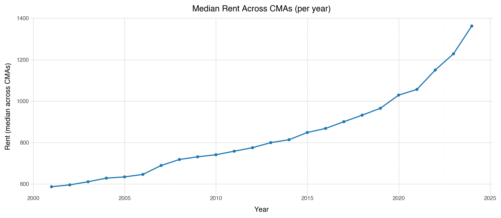
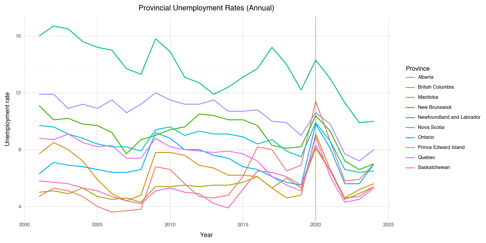
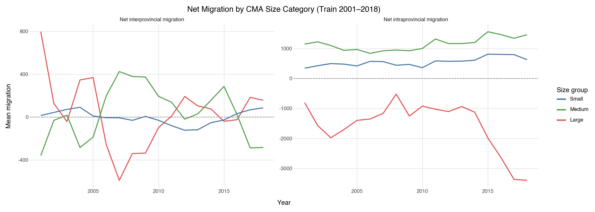

# Internal Migration in Canada: Push and Pull Factors, Lag Effects, and Covid-19 Shock

Link to GitHub repository where the code and data can be found: <https://github.com/jennifer1046/JSC370/tree/main/JSC370_2026/project/canada_migration>

Raw data is not uploaded due to large file size. The processed data directory has the merged dataset and the train/test splits. 

## Introduction

### Background and Literature

Regulations and stories about immigration have pervaded Canadian news in recent years. Much less attention is being paid to internal migration. Yet the study of internal migration can inform planning for infrastructure and public services, as well as helping researchers understand the change in the population composition of different regions. From the early 1970s to the late 2010s, Canada’s aggregated number of interprovincial migrants is relatively stable (Chastko, 2021). However, the net interprovincial migration rate differs substantially across provinces. 

Another source of instability lies in the destinations of internal migration. While the Canadian population is still concentrated in a few areas such as Toronto, Vancouver and Montreal, these Census Metropolitan Areas (CMAs) have seen an exodus in recent years owing to high housing cost and general cost of living (McQuillan, 2024).

The article by Song et al. (2026) explains the motivation for the movement within and across provinces, citing housing conditions and employment opportunities as the top reasons. These results are based on the Canadian Housing Survey conducted in 2022. 

This project aims to empirically test the predictive power of a series of demographic and socioeconomic variables on internal net migration rates in Canada. 

### Research Questions
1. How much variance in internal migration in Canada is explained by demographic and socioeconomic push and pull factors? This problem is further decomposed into two subproblems: interprovincial and intraprovincial migration. 
2. As an extension to RQ1, does lagging the key push/pull factor by one to two years improve out-of-time prediction of net migration above the contemporaneous baseline from RQ1? For instance, increased rental pressure prompts people to move, but this effect is likely not immediate. 
3. Did internal migration trends in 2020-2022 systematically differ from the pre-Covid trends? The Covid-19 pandemic is a shock event that directly or indirectly alters migration patterns within Canada. 

### Hypotheses
1. The push and pull factors of the two types of migration are likely different.
2. The models with lagged variables are hypothesized to perform slightly better than the baseline models. 
3. The Covid-19 pandemic is hypothesized to be associated with in-migration in small to medium CMAs and out-migration in large CMAs, holding the control variables fixed. 

### Datasets
Here is the list of datasets used in this project. All tables are retrieved from Statistics Canada, using its API. 

- Table 17-10-0149-01: Components of population change by census metropolitan area and census agglomeration, 2021 boundaries
- Table 27-10-0273-02: Expenditures on research and development (R&D) by performing sector (x 1,000,000)
- Table 34-10-0133-01: Canada Mortgage and Housing Corporation, average rents for areas with a population of 10,000 and over
- Table 14-10-0020-01: Unemployment rate, participation rate and employment rate by educational attainment, annual
- Table 17-10-0148-01: Population estimates, July 1, by census metropolitan area and census agglomeration, 2021 boundaries

Each data table released by Statistics Canada usually has a small number of features. Such display makes descriptive statistics convenient, but a modelling task requires features to be assembled and merged into a clean dataframe. 

## Methods

### Data Acquisition

The Statistics Canada API is used to pull tabular data over the year range 2001 to 2024. For some datasets whose last update is prior to 2024, the data from 2001 to the latest year is pulled.

The main function for API access is `pull_statcan`. It takes in a table identifier, streams the response into a temporary file, extracts the CSV from the ZIP file and returns a pandas DataFrame. There are many helper functions for normalizing the columns and dropping unnecessary columns like "STATUS" and "DECIMALS". Downloaded tables are cached locally so that on subsequent runs, the cached CSVs are read directly to avoid unnecessary API calls. 

### Data Cleaning and Wrangling

To ensure that the datasets can be merged harmoniously without conflicts on the temporal or geographic scales, all tables have annually collected data. The geographic granularity for most tables is Census Metropolitan Area (CMA) and Census Agglomeration (CA). **The unit of analysis for this project is CMAs.** Thus, tables are filtered to rows that correspond to CMAs only, except for the tables for R&D and for unemployment rates. Research and Development is used as a predictor in the interprovincial model only, so we only needed data at the provincial level. Unemployment rates are collected at the provincial level as well, but we map the CMAs to their provinces e.g. Toronto to Ontario.

We want to merge the tables are (geo_key, year), where geo_key corresponds to a CMA like Toronto or a province like Ontario. A challenge in merging the dataframes lies in the misalignment of the exact names of geographic regions. Statistics Canada geography labels include a type suffix for CMA, which is absent in some tables. A normalisation function normalise_geo strips these suffixes, removes whitespace, and converts strings to lowercase. For example, "Toronto (CMA), Ontario" and "Toronto, Ontario" both normalise to "toronto, ontario". 

### Null Values
Null values can occur for 3 reasons: 
  1. Cause A: statistical suppresion, where Statistics Canada withholds values for small geographic areas
  2. Cause B: geographic mismatch, where the CMA key in a df does not match any key in the main table
  3. Cause C: the CMA exists in a particular df but has no observation for some years

For the rent df, two CMAs, Belleville-Quinte West and Ottawa-Gatineau (Ontario part), had persistent Cause B mismatches that could not be resolved through normalisation. These two CMAs were dropped entirely from the dataset. For cause C, Chilliwack was missing rent data for 2006, and we used the mean of 2005 to 2007 to impute it. 

The merged dataframe has 960 rows and 18 columns, where 960 = 40 CMAs * 24 years. 

### Tools and Statistical Methods

Python librarires: Data manipulation is handled with `pandas` and `numpy`. Visualizations are produced with `plotnine`. The statistical models e.g. OLS are fitted using `statsmodels`. Later, for the machine learning models e.g. Random Forest and XGBoost, `scikit-learn` will be used. 

Before merging, EDA is conducted on individual tables first. The purpose was to check the years covered by each dataframe, check for missingness, and understand the distribution of features and outcomes. 

After merging, the dataset is split into training and test sets: years 2001 to 2018 belong to the training set. Years 2019 to 2024 comprise the test set. 

Summary statistics (mean, std, min, max, % missing) are reported for all features and the two outcomes, separately for the training and test sets. The remaining EDA is done on the training set only:
  - Spearman correlation heatmap
  - Time series of mean net migration plotted by CMA size category
  - A violin-box plot to compare the migration distribution of pre-Covid period and Covid/post-Covid period, faceted by CMA size. 

Variance Inflation Factors (VIFs) are calculated on the list of candidate features in order to assess multicollinearity. Larger VIF indicates that two or more features are correlated, so we should consider combining or removing features. 

For model training and evaluation, we use the standard machine learning pipeline, with a 75/25 split of the data. A hold-out test set of approximately 25% of the merged dataset is created and excluded from exploratory data analysis and model training. For cross-validation, time series data cannot be partitioned using `train_test_split` directly, as such an approach leads to data leakage. The specialized `TimeSeriesSplit` is used to produce cross-validation folds. 5 fold cross-validation is conducted. 

## Preliminary Results

### EDA on Individual Tables
```{python}
#| label: midterm-output-setup
#| echo: false
from pathlib import Path
from html import escape
import pandas as pd

PROJECT_ROOT = Path.cwd()
TABLES_DIR = PROJECT_ROOT / "outputs" / "tables"

def html_table(df: pd.DataFrame, formats: dict[str, object] | None = None, group_col: str | None = None) -> str:
    formats = formats or {}

    def fmt_value(col, val):
        if pd.isna(val):
            return ""
        formatter = formats.get(col)
        if callable(formatter):
            return formatter(val)
        if isinstance(formatter, str):
            return formatter.format(val)
        return str(val)

    num_cols = set(df.select_dtypes(include=["number"]).columns)
    headers = []
    for col in df.columns:
        cls = ' class="num"' if col in num_cols else ""
        headers.append(f"<th{cls}>{escape(str(col))}</th>")

    lines = ['<table class="report-table">', "<thead>", "<tr>", *headers, "</tr>", "</thead>", "<tbody>"]
    sentinel = object()
    prev_group = sentinel
    for _, row in df.iterrows():
        if group_col is not None and row[group_col] != prev_group and prev_group is not sentinel:
            lines.append(f'<tr class="group-gap"><td colspan="{len(df.columns)}"></td></tr>')
        prev_group = row[group_col] if group_col is not None else prev_group

        cells = []
        for col in df.columns:
            cls = ' class="num"' if col in num_cols else ""
            cells.append(f"<td{cls}>{escape(fmt_value(col, row[col]))}</td>")
        lines.extend(["<tr>", *cells, "</tr>"])
    lines.extend(["</tbody>", "</table>"])
    return "\n".join(lines)
```

The individual-table EDA below highlights the main patterns in the source tables before any merge is carried out.

{fig-cap="Figure 1. National aggregate net interprovincial and intraprovincial migration across CMAs, 2001–2024." width="95%"}

When we aggregate the net interprovincial and intraprovincial migration across CMAs, we see that they behave quite differently over 2001 to 2024. Net intraprovincial migration is relatively stable up to 2015, then it starts to decline. This means that out-migration from CMAs to other CMAs in the same province started before Covid. It hits the minimum in 2021, then starts to recover. But by 2024, the aggregated intraprovincial migration is still very negative. For interprovincial migration, it is stable up to 2020. During Covid, interprovincial migration turns negative

{fig-cap="Figure 2. Distribution of net interprovincial and intraprovincial migration across CMA-years." width="95%"}

The distributions of both net inter and intraprovincial migration are symmetric. But the issue is that the majority of observations have near-zero net migration. The Ordinary Least Squares regression may not be a good fit because predictions could be pulled towards the rare extreme observations, producing large residuals.
But it can serve as a baseline for comparison with more capable models like Random Forest.

{fig-cap="Figure 3. Median rent across CMAs by year." width="85%"}

As expected, the median rent across CMAs increases monotonically from approximately $600 in 2021 to nearly $1400 in 2024. 

{fig-cap="Figure 4. Provincial unemployment rates, 2001–2024." width="95%"}

Most provinces show similar trend in employment rates within the study period, with a spike in 2020. But the actual values are different across provinces. Newfoundland and Labrador has the highest unemployest rates in all years. This justifies using unemployment rate for predicting the outcome.

### Summary Statistics: The Challenge of Out-of-Time Prediction

Here are the respective summary statistics on the training and test sets. All the subsequent exploratory data analysis (EDA) is done solely on the training set. 

```{python}
#| label: midterm-summary-stats
#| echo: false
#| output: asis
summary_formats = {
    "mean": "{:,.3f}",
    "sd": "{:,.3f}",
    "min": "{:,.3f}",
    "max": "{:,.3f}",
    "pct_missing": "{:.2f}",
}

train_summary = html_table(pd.read_csv(TABLES_DIR / "4a_train_summary_stats.csv"), summary_formats)
test_summary = html_table(pd.read_csv(TABLES_DIR / "4a_test_summary_stats.csv"), summary_formats)
print(
    '<div class="table-grid">'
    '<div class="table-panel"><div class="table-caption">Table 1. Train summary statistics</div>'
    f'{train_summary}</div>'
    '<div class="table-panel"><div class="table-caption">Table 2. Test summary statistics</div>'
    f'{test_summary}</div>'
    '</div>'
)
```

From the two tables side by side, several features drastically changed between the training period (2001-2018) and the test period (2019-2024), which is a challenge of out-of-time prediction. The average rent almost doubled. The mean international migration increased, and the natural increase rate decreased. 

But this is also a motivation for the RQs, especially RQ3, where we investigate the effect of Covid-19 on migration patterns using statistical inference.

### EDA on Merged Table (Train Set Only)
The merged-panel EDA below is restricted to the training period only.

#### 
{fig-cap="Figure 5. Spearman correlation heatmap for the train set." width="95%"}

This correlation heatmap helps us identify candidate features for predicting net interprovincial and intraprovincial migration. Net interprovincial migration has a correlation of -0.28 with employment rate, which is consistent with findings from the Canadian Housing Survey: as unemployment increases, net interprovincial migration decreases, meaning less people move to this CMA from another province. 

{fig-cap="Figure 6. Mean net migration by CMA size category in the training period." width="95%"}

We see that especially for intraprovincial migration, the magnitude of net migration differs meaningfully depending on CMA size category. This is motivation that we construct a categorical variable based on the CMA's population. For interprovincial migration, the trend differs between CMA size categories, but it is difficult to model because there is no consistent trend over the 2001 to 2018 period.

{fig-cap="Figure 7. Distribution shift in net migration across the pre-Covid, transition, and Covid/post-Covid periods, faceted by CMA size." width="95%"}

This figure shows how the distribution of net migration shifted across three periods: pre-Covid (2001–2018), the transition year (2019), and Covid/post-Covid (2020–2024). It's then broken down by CMA size category. The most striking pattern is in the bottom right panel, where large CMAs experienced a dramatic increase in intraprovincial out-migration during the post-Covid period. The distribution shifts downward and has a very long lower tail. By comparison, the migration pattern for small CMAs barely change over time. For interprovincial migration, in the post-Covid period, large CMAs show polarization. Some large CMAs have high in-migration from other provinces, others have high out-migration to other provinces.

This figure provides support for including CMA size as a feature in all models for RQ1. 


```{python}
#| label: midterm-eda-vif
#| echo: false
#| output: asis
vif_formats = {"vif": "{:.3f}"}
print('<div class="table-caption">Table 3. Full train-set VIF on the unreduced feature list</div>')
print(html_table(pd.read_csv(TABLES_DIR / "4h_vif_full_train.csv"), vif_formats))
```

For the demographic variables, the VIFs are very high, which makes sense because currently, three variables related to population are in the feature set: log_population, share_25_44, and share_65plus. This is especially problematic for linear models. For tree-based models e.g. Random Forest, multicollinearity is less concerning in terms of prediction, but I still reduced the feature set by removing some demographic variables to aid interpretation. Therefore, I reduced the feature set, dropping avg_rent, share_25_44, log_population, and participation_rate. 

Using insights from the EDA, I added CMA size as a categorical variable. Also, I included year as a numeric variable to account for features that change linearly with year.

### Preliminary Statistical Analysis
```{python}
#| label: midterm-prelim-models
#| echo: false
#| output: asis
model_formats = {
    "n_train": "{:.0f}",
    "n_test": "{:.0f}",
    "cv_r2_mean": "{:.6f}",
    "cv_r2_sd": "{:.6f}",
    "cv_rmse_mean": "{:,.3f}",
    "cv_rmse_sd": "{:,.3f}",
    "alpha": lambda x: "" if pd.isna(x) else f"{x:.6f}",
    "r2_test": "{:.6f}",
    "rmse_test": "{:,.3f}",
}

print('<div class="table-caption">Table 4. Time-series cross-validation and holdout test results</div>')
print(html_table(pd.read_csv(TABLES_DIR / "5_model_results.csv"), model_formats, group_col="outcome"))
```

#### OLS model summaries

```{python}
#| label: midterm-ols-summaries
#| echo: false
import statsmodels.formula.api as smf

train_df = pd.read_csv(PROJECT_ROOT / "data" / "processed" / "train.csv")
eda_train = train_df.loc[train_df["geo_type"].eq("CMA")].copy()
pop_ref = eda_train.loc[eda_train["year"].between(2016, 2018, inclusive="both")].groupby("geo_key")["population"].median().dropna()
if pop_ref.empty:
    pop_ref = eda_train.groupby("geo_key")["population"].median().dropna()
q1, q2 = pop_ref.quantile([1 / 3, 2 / 3]).astype(float)
size_map = {k: ("Small" if v <= q1 else "Medium" if v <= q2 else "Large") for k, v in pop_ref.items()}
train_model = train_df.assign(cma_size=train_df["geo_key"].map(size_map).fillna("Unknown"))

base_feats = ["rent_deviation", "unemployment_rate", "share_65plus", "intl_inmigration", "cma_size", "year"]
outcome_specs = [
    ("net_interprovincial", base_feats + ["rd_provincial"]),
    ("net_intraprovincial", base_feats),
]

for outcome, feats in outcome_specs:
    tr = train_model[[outcome] + feats].dropna().copy()
    formula = f"{outcome} ~ " + " + ".join("C(cma_size)" if feat == "cma_size" else feat for feat in feats)
    fit = smf.ols(formula, data=tr).fit(cov_type="HC3")
    label = outcome.replace("_", " ").title()
    print(f"\nOLS summary — {label}\n")
    print(fit.summary())
```

For interprovincial migration, the results for OLS and Ridge regression are almost identical. The CV R^2 is 0.05, and the R^2 on the hold out test set is approximately 0.1. Lasso regression performs slightly worse, with a test R^2 of 0.09.

For intraprovincial migration, OLS and Lasso regression have a CV R^2 of 0.79, and a test R^2 of 0.63. Ridge regression performs slightly worse.

## Summary

### Findings So Far: what aspects of the research questions have been answered

Currently, the OLS model, the Ridge regression, and the Lasso regression provide a preliminary answer to RQ1. For interprovincial migration, the OLS model fitted on the train set explains only 13.6% of variance (holdout R^2 = 0.10), with unemployment rate and rent deviation as the dominant predictors. For intraprovincial migration, the OLS model fitted on the train set explains 77.9% of variance (holdout R^2 = 0.63), with share of elderly population, international in-migration, and CMA size as the strongest predictors. The year coefficient is positive and significant, indicating an upward trend in intraprovincial migration that the baseline features do not fully account for.

RQ2 is unanswered and is dependent on final results from RQ1. We need to identify the most powerful push and pull factors for interprovincial and intraprovincial migration respectively. Then we can construct the lag variables and investigate whether using lagged variables gives us more predictive power. A concrete example is: whether the average rent in 2004 is better at predicting net migration in 2005 than the average rent in 2005. 

The results from EDA and from RQ1 motivate RQ3 because we are observing a time effect that is not linear. The Covid-19 period produces a change in migration patterns beyond a linear effect for year. 

### Plan for Final Project

List of steps:

1. For RQ1, the following models will be trained, tuned and evaluated against the current baseline OLS model and Ridge/Lasso regression which produced similar results:

  - Generalized Additive Model (GAM)

  - Random Forest, with the following proposed hyperparameters to tune: `n_estimators`, `max_features`, `max_depth`, and `min_samples_leaf`

  - XGBoost, with the following proposed hyperparameters to tune: `n_estimators`, `max_depth`, `learning_rate`, and `colsample_bytree`

 For models with a lot of tunable hyperparameters and consequently a large grid, such as Random Forest and XGBoost, `RandomizedSearchCV` will be used. 

2. RQ2 requires more feature engineering. 

  - Once the most important predictors of net migration are identified (through the SHAP importance scores), e.g., avg_rent, we will engineer lagged features avg_rent at year t-1 and t-2 to predict net migration at year t. The goal is to capture the delay between when conditions change and when migration responds. 

3. RQ3 is a statistical inference and not a prediction task. 

  - An OLS model will be fitted on the full dataset (no train/test split) and interpreted. The proposed model formula is: 
  $$
\begin{aligned}
\text{net\_intraprovincial} \sim\, &\text{avg\_rent} + \text{rent\_deviation} + \text{unemployment\_rate} \\
&+ \text{share\_65plus} + \text{intl\_inmigration} + \text{natural\_increase\_rate} \\
&+ \text{post\_covid} + \text{post\_covid} \times \text{cma\_size} + \text{year}
\end{aligned}
$$
    - year controls for the time by giving each year a unique intercept 
    - post_covid is the main effect for Covid-19. It is a binary indicator: 0 for 2001 to 2019, 1 otherwise. Its coefficient estimates the average change in migration across all CMAs during the Covid-19 period, after controlling for the baseline features and the year. 
    - post_covid:cma_size estimates whether the change in migration associated with Covid-19 is different for large vs. small vs. medium CMAs.

  - A GAM model will be fitted and compared with baseline OLS to check for nonlinear effects.

The final project will include two additional components: a GitHub website, and interactive visualizations. 


## References

- Chastko, K. (2021, July 14). Report on the demographic situation in Canada internal migration: Overview, 2016/2017 to 2018/2019. Internal migration: Overview, 2016/2017 to 2018/2019. https://www150.statcan.gc.ca/n1/pub/91-209-x/2021001/article/00001-eng.htm 
- McQuillan, K. (2024). Leaving the big city: New patterns of migration in Canada. The School of Public Policy Publications, 17(1). https://doi.org/10.55016/ojs/sppp.v17i1.78322 
- Song, G., Charbonneau, P., Chastko, K., & Grueva, S. (2026, February 16). Why do people move within Canada? A study on the reasons for internal migration and mobility using the Canadian Housing Survey. Statistics Canada. https://www150.statcan.gc.ca/n1/pub/91f0015m/91f0015m2026001-eng.htm 
- Statistics Canada. Table 17-10-0149-01  Components of population change by census metropolitan area and census agglomeration, 2021 boundaries
- Statistics Canada. Table 27-10-0273-02  Expenditures on research and development (R&D) by performing sector (x 1,000,000)
- Statistics Canada. Table 34-10-0133-01  Canada Mortgage and Housing Corporation, average rents for areas with a population of 10,000 and over
- Statistics Canada. Table 14-10-0020-01  Unemployment rate, participation rate and employment rate by educational attainment, annual
- Statistics Canada. Table 17-10-0148-01  Population estimates, July 1, by census metropolitan area and census agglomeration, 2021 boundaries
